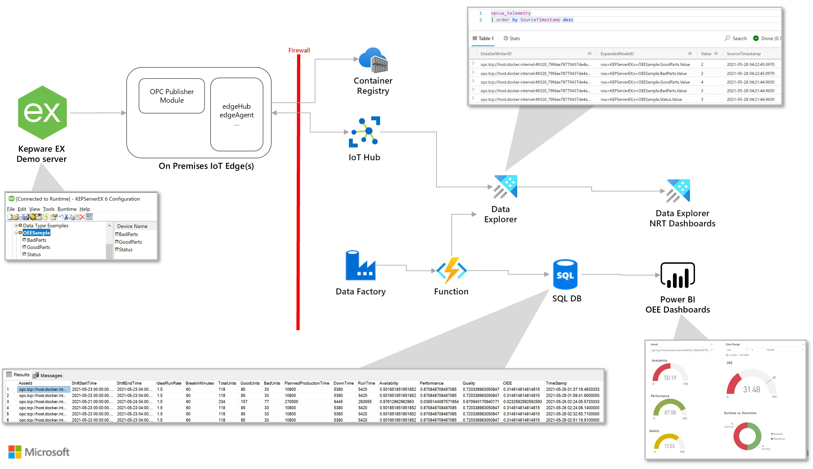
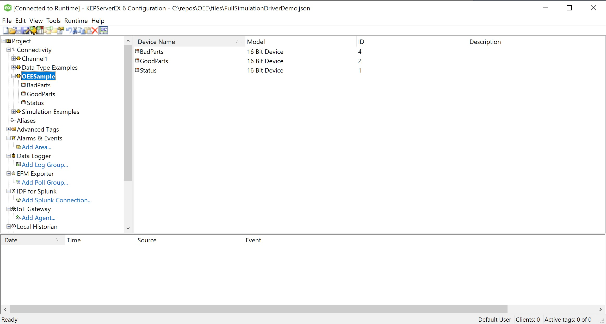
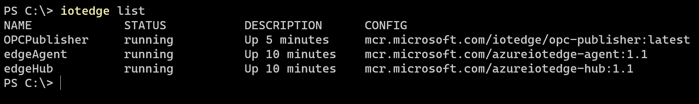
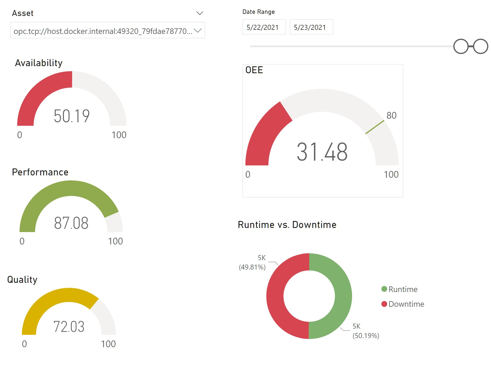

:warning: In progress

# OEE Solution with Near Real Time Availability and Quality

This is a sample OEE solution to demo the design pattern. Kepware EX Demo Server is used as the OPC UA Server. The Edge Gateway Device is a Windows 10 PC. Both Kepware and Edge Gateway are installed on the same device for simplicity.

## Prerequisites
- Windows 10 PC
- Visual Studio Code
- Azure Subscription

## Install and Configure Demo OPC UA Server

*This sample uses the Kepware EX Server but you can use any other test server like the [OPC PLC server](https://github.com/Azure-Samples/iot-edge-opc-plc), [node-red-contrib-opcua](https://flows.nodered.org/node/node-red-contrib-opcua) or others.*

- Install [Kepware EX Demo Server](https://www.kepware.com/en-us/products/kepserverex/)
    
- Setup [Kepware OPC UA Configuration](https://www.kepware.com/getattachment/de80e240-765e-451a-afce-640d413891c3/opc-ua-configuration-manager-manual.pdf)

    - Open `OPC UA Configration Manager` in KepWare Administration
    - Make sure `opc.tcp://127.0.0.1:49320` endpoint in Enabled

- Open the KepwareEX 6 Configuration, and open the [files/FullSimulationDriverDemo.json](files/FullSimulationDriverDemo.json)
    - This file contains a new Channel configuration named `OEESample` with 3 tags

    

## Create and Configure Azure IoT Hub

*IoT Hub is used as the cloud gateway to ingest data from multiple OPC Server*

- Create new IoT Hub or use existing is already created.

- Create a new IoT Edge device and copy the connection string.

## Install and Configure IoT Edge on Windows 10 PC

*IoT Edge enables store & forward functionality as well as secure connection between the OPC Server and the cloud gateway. For this demo we will use docker desktop but for production consider using [EFLOW](https://techcommunity.microsoft.com/t5/internet-of-things/announcing-the-ga-of-azure-iot-edge-for-linux-on-windows/ba-p/2477508) for running linux containers on windows*

- Install [Docker Desktop](https://hub.docker.com/editions/community/docker-ce-desktop-windows)

- Create new docker network `docker network create azure-iot-edge`

- Install IoT Edge via [IoT Edge Installer](https://github.com/Azure/Industrial-IoT-Gateway-Installer/tree/master/Releases)

- Copy [edge/publishednodes.json](edge/publishednodes.json) file to `C:\IoTEdgeMapping` and update the EndPointUrl if your OPC Server is on a different box.

- Install [OPC Publisher Module](https://github.com/azure/iot-edge-opc-publisher#getting-started) using Azure Portal
  
    - Use [edge/opcpublisher-container-create-options.txt](edge/publisher-container-create-options.txt) file for container create options

- Or you can use the [edge/edgeManifest.json](edge/edgeManifest.json) to create a new edge deployment.

    

- Open `OPC UA Configration Manager` in KepWare Administration

- Click on `Trusted Clients` and Import the `Mirosoft.Azure.IIoT` certificate from `C:\IoTEdgeMapping\pki\trusted\certs` location.

- Open the KepwareEX 6 Configuration, click Runtime -> Reinitialize

- Restart OPCPublisher module using `iotedge restart OPCPublisher`

## Create and Configure Azure Data Explorer

*Data explorer is the near real time big data store to analyze telemetry coming out of the cloud gateway.*

- Create Data Explorer Cluster with `Workload` as `Dev/Test` and `Streaming Ingestion` set to `On`

- Add database named `opcdb`

- Add data connection in the database with connection type as `IoT Hub` and select the IoT Hub that we created in the previous step.
    - Shared Access Policy=iothubowner
    - Table name= [Blank]
    - Data format=MULTILINE JSON
    - Mapping name=opcua_mapping

- Open [http://dataexplorer.azure.com/](http://dataexplorer.azure.com/), add you cluster 
- Run the [kusto/setup.sql](kusto/setup.kql) script on the opcdb database.

## Create and Configure Azure SQL DB

*SQL DB is used to store the aggregated data from OEE calculation to enable basic reporting*

- Create SQL DB and run the [sql/dbscript.sql](sql/AssetOEE.sql) script to create the tables

    - *Make sure to update the Shift configuration values according to you shift timings & timezone* 

## Create and Configure Azure Function

*Python function app (serverless compute) is used as the on demand compute to run OEE calculations. The actual calculation code is inside a python package which can be executed in multiple other computes like databricks, synapse spark or even inside a module on the edge.*

- Open the [function](function) folder in VS Code and rename `local.settings.txt` to `local.settings.json`

- Update configuration values in `local.settings.json` file

- Use Visual Studio Code to test & deploy Azure Function as shown [here](https://docs.microsoft.com/en-us/azure/azure-functions/create-first-function-vs-code-python).

- Call the Function API few times to generate the OEE data.

- Test below query in SQL Server DB and make sure it returns some results
    - `SELECT * FROM AssetOEE`

## Setup OEE Dashboard

- Download and open [OEE Power BI Sample Report](files/oee.pbix)

- Connect to your SQL DB and Refresh the report

    

## [Optional] - Create and Configure Azure Data Factory

- *Additionally, you can configure data factory to invoke the Function API on a schedular*

## Additional Resources

- [OPC Publisher command line options](https://github.com/Azure/iot-edge-opc-publisher/blob/main/docs/CommandLineArguments.md#opc-publisher-command-line-arguments-for-version-26-and-above)  

- [OPC Publisher nodes template file](https://raw.githubusercontent.com/Azure/iot-edge-opc-publisher/main/opcpublisher/publishednodes.json)