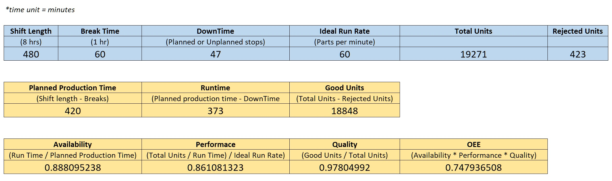
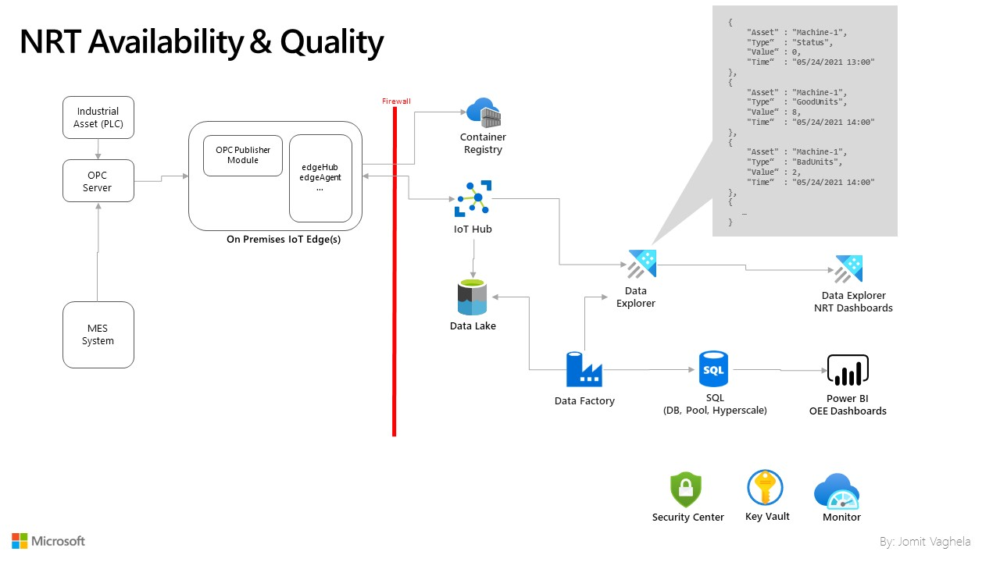
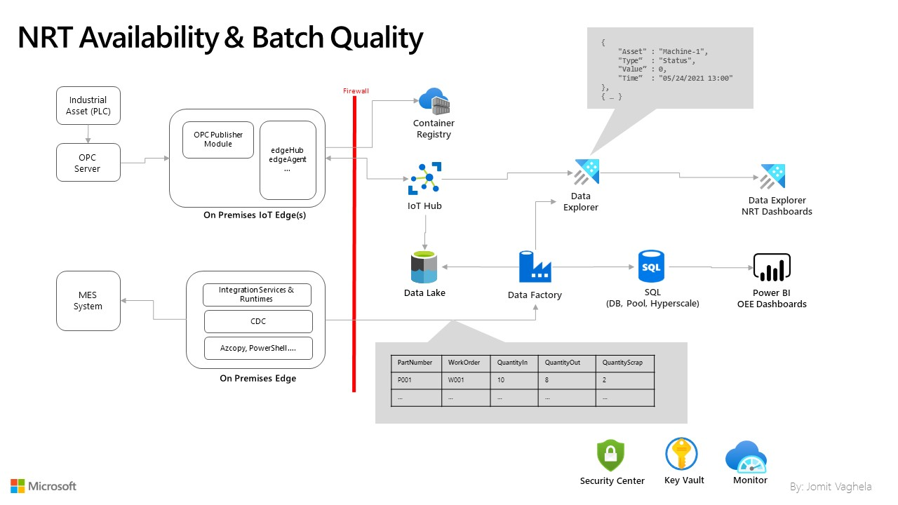
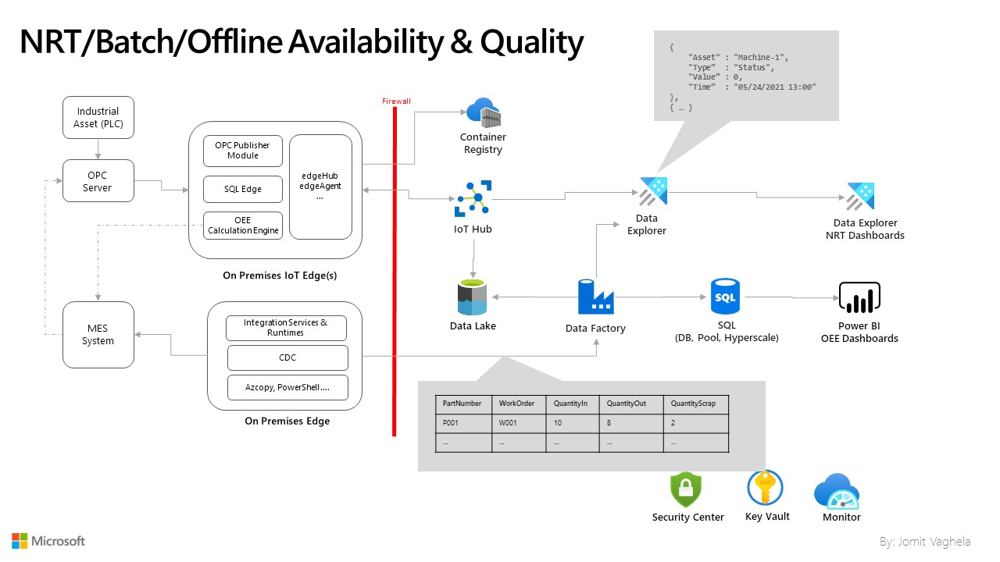

# Overall Equipment Effectiveness (OEE)

Overall Equipment Effectiveness is a measure of how well a manufacturing operation is utilized (facilities, time and material) compared to its full potential, during the periods when it is scheduled to run. It identifies the percentage of manufacturing time that is truly productive. An OEE of 100% means that only good parts are produced (100% quality), at the maximum speed (100% performance), and without interruption (100% availability).

Measuring OEE is a manufacturing best practice. By measuring OEE and the underlying losses, important insights can be gained on how to systematically improve the manufacturing process. OEE is an effective metric for identifying losses, bench-marking progress, and improving the productivity of manufacturing equipment (i.e., eliminating waste)

Total effective equipment performance (TEEP) is a closely related measure which quantifies OEE against calendar hours rather than only against scheduled operating hours. A TEEP of 100% means that the operations have run with an OEE of 100% 24 hours a day and 365 days a year (100% loading).

For more details and history of OEE, read [this](https://en.wikipedia.org/wiki/Overall_equipment_effectiveness)

## Calculating Basic OEE

More details [here](OEECalculation.md).

## Design Patterns

More details on pros/cons for each design [here](OEEDesignPatterns.md)

## Getting Started

- [Near Real Time Availability & Quality](OEEEngineSample.md)